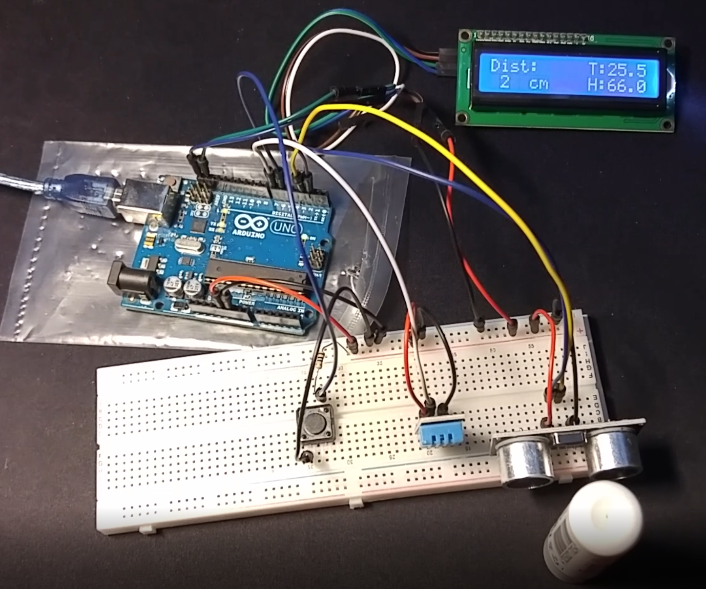

### ARDUINO PROJECT: HC-SR04 + DHT11 + I2C
Visualización de los datos de temperatura, humedad y proximidad sobre una pantalla LCD con Arduino

##### Elementos necesarios:
- Arduino UNO
- Protoboard
- Sensor DHT11 de temperatura y humedad
- Sensor HC-SR04 de proximidad
- Pulsador de membrana
- Pantalla LCD con acople I2C
- Cables
- Resistencia

##### Configuración de sensores:
- DHT11 - PIN 7 DIGITAL
- I2C   - PINES SDA Y SCL DE ARDUINO
- SR04  - PINES DIGITALES 2 (TRIGGER) Y 3 (ECHO) 
- PULSADOR - PIN 6 DIGITAL

#####  Referencias:
Codigo fuente DTH: https://programarfacil.com/blog/arduino-blog/sensor-dht11-temperatura-humedad-arduino/
Codigo fuente I2C: http://educ8s.tv/arduino-20x4-character-lcd/
Codigo fuente SR04: https://www.makerguides.com/hc-sr04-arduino-tutorial/

Libreria DHT:      https://github.com/adafruit/DHT-sensor-library
Libreria LCD:      https://bitbucket.org/fmalpartida/new-liquidcrystal/downloads
